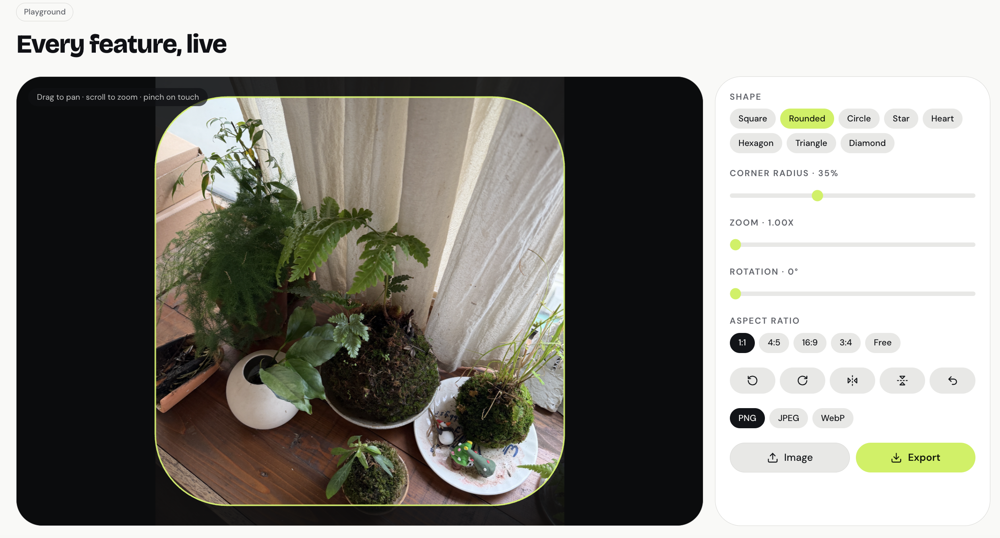

# Vropper Vue



> Shape-aware image cropper for Vue 3.

`@tlob/vropper-vue` is the Vue 3 integration for Vropper, a TypeScript-first image cropping library.

It provides a simple Vue component for cropping, rotating, flipping, and masking images with customizable crop shapes.

## ✨ Features

- 🖼️ Image cropping
- 🔄 Image rotation
- ↔️ Horizontal and vertical flipping
- ⬜ Square crop
- ⭕ Rounded and circular crop
- ⭐ Shape-based cropping
- 💗 Love-shaped crop
- 🎨 Customizable crop shapes
- 💚 Vue 3 support
- 📘 TypeScript support
- 📦 npm, pnpm, yarn, and Bun compatible

## 📦 Installation

### npm

```bash
npm install @tlob/vropper-vue
```

### pnpm

```bash
pnpm add @tlob/vropper-vue
```

### yarn

```bash
yarn add @tlob/vropper-vue
```

### bun

For framework-independent usage:

```bash
bun add @tlob/vropper-vue
```

## 💡 Usage
```bash
<script setup lang="ts">
import { Vropper } from "@tlob/vropper-vue";
import "@tlob/vropper-vue/style.css";
</script>

<template>
  <Vropper
    src="/example.jpg"
    :width="400"
    :height="400"
  />
</template>
```

## 🎨 Crop Shapes

Vropper is designed around a shape-based cropping system.

Built-in shapes include:

- ⬜ Square
- ⭕ Rounded
- ⭐ Star
- 💗 Love

Example:

```bash
<Vropper
  src="/example.jpg"
  shape="circle"
/>
```
## 📚 Documentation

Full documentation, examples, and an interactive playground are available at:

https://vropper.vercel.app/
